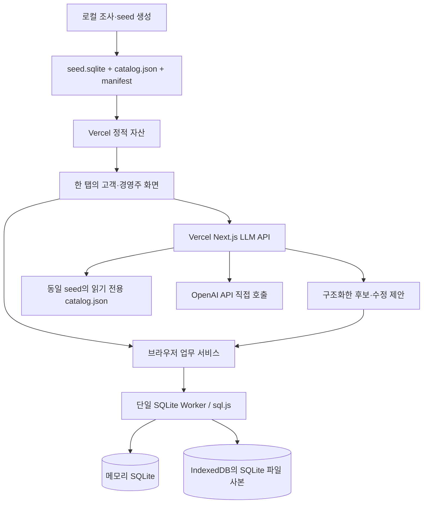

# 시스템 아키텍처 기준선

D-43에 따라 한 PC·한 브라우저 탭에서 고객/경영주 역할을 전환하는 SQLite 데모다. 외부 DB·Marketplace 설정은 필요 없다. 아래는 구현 기준선이며 앱·배포 시험은 아직 실행하지 않았다. 세부 저장·복구 계약은 [29번](29-browser-sqlite-demo.md)을 따른다.

## 구성



| 영역 | 기준선 | 책임 |
|---|---|---|
| FE | Next.js/React + TypeScript | 한 탭의 역할 전환·입력·결과·모의 알림 |
| 도메인·업무 서비스 | 공통 TypeScript + 브라우저 실행 | 수량·가격·예산·동의·FIFO·기한·상태 전이 검증 |
| DB | sql.js의 SQLite WASM, 단일 Worker/연결 | 실제 SQL 테이블·제약·트랜잭션. 서버 DB 없음 |
| 파일 사본 | IndexedDB | SQLite export 바이트와 버전을 저장·복원. 두 번째 업무 DB로 쓰지 않음 |
| BE | Vercel Next.js Route Handlers, Node.js | 모델 인증·입출력 검증·정적 카탈로그 검색·LLM 호출 |
| 배포 | 하나의 Vercel 프로젝트 | 앱·WASM·초기 DB 파일·카탈로그·모델 API |
| 검색 | 별칭·속성·정규화 키워드 | 200개 이상의 카탈로그 기준선. 벡터 검색은 선택 |
| 모델 | OpenAI API 직접 호출 | 서버에서만 키 사용, 25번의 설정·사용량·품질 계약 유지 |

sql.js는 기존 SQLite 파일을 메모리에 읽고 export할 수 있다. WASM은 설치 버전과 맞춰 앱에서 직접 제공한다. 버전은 goal 구현 시 선택해 lockfile에 고정한다. 별도 SQLite 서버·Neon·Blob·Redis·DB URL·pgvector를 추가하지 않는다.

## 코드 경계 예시

```text
app/customer/             고객 화면
app/merchant/             경영주 화면
app/api/                  상품/경영주 LLM API·health
src/domain/               순수 상태·금액·발주·배정 규칙
src/services/             브라우저 명령과 조회 서비스
src/db/                   Worker·SQL·마이그레이션·snapshot 저장
src/agents/               서버 전용 지시문·모델 어댑터
src/search/               공통 카탈로그 검색
src/contracts/            로컬 명령 및 모델 API 계약
src/demo/                 역할·시계·공급·모의 결제·reset
public/demo/              검증한 seed.sqlite·manifest·WASM
scripts/                  조사 데이터 검증·seed 생성·카탈로그 export
tests/                    단위·SQLite 통합·브라우저 E2E·eval
```

상품·점포 조사 사실과 모의 거래를 구분한다. DB와 서버 카탈로그는 같은 입력에서 만들고 hash/version으로 일치를 검사한다. holdout 정답·실제 개인정보·API 키는 배포 자산에 넣지 않는다.

## FE/BE와 신뢰 경계

- 거래 상태의 기준은 브라우저 SQLite다. 서버는 이 DB를 직접 조회하거나 수정하지 않는다.
- 모델은 후보·설명·제안만 반환한다. 브라우저 업무 서비스가 현재 역할·세션·동의·예산·상품·상태를 재검사한 뒤 SQL 트랜잭션으로 적용한다.
- 고객/경영주 역할 제한은 데모 조작 오류 방지다. 클라이언트를 변조하는 공격자를 막는 서버 인증·거래 보장으로 주장하지 않는다.
- 서버 API는 요청 크기·형식·허용 작업·카탈로그 SKU·모델 응답을 검증한다. 브라우저가 보낸 거래 수치가 신뢰할 수 있는 서버 기록이라고 가정하지 않는다. 입력으로 API 키·provider endpoint·임의 SQL 실행을 받지 않는다.
- API 키와 모델 인증은 서버 전용이다. DB를 로컬로 바꿔도 모델을 브라우저에서 직접 인증 호출하지 않는다.
- LLM 요청의 session/generation/request ID·catalog version을 응답과 대조한다. reset/역할 전환/새 입력 뒤 늦은 응답을 기존 상태에 적용하지 않는다.

## 한 PC 데모 범위

고객→경영주→고객 전환은 같은 탭·같은 DB에서 수행한다. 여러 기기·프로필·탭을 하나의 공유 DB로 동기화하지 않는다. 두 독립 QA는 각자 한 탭에서 전체 흐름을 재현하거나 같은 export 스냅샷을 별도로 복원하며, 독립 검토자라는 이유로 DB가 공유된다고 가정하지 않는다.

자동발주는 앱이 열린 동안 새 요청·조건 변경·검토 버튼 등 이벤트에서 실행한다. 페이지가 닫힌 뒤 서버가 계속 발주하거나 알림을 전송하는 기능은 없다. 다시 열면 저장된 상태·데모 시계로 기한을 재검사한다. 고객 선택·구매 동의·경영주 정책 승인 절차는 유지한다.

## 저장·시간·복구

SQLite의 변경 명령은 한 연결에서 순차 처리한다. 다중 사용자 경합·분산 잠금·서버 간 예산 재검증 시험은 제외한다. 중복 클릭·동일 명령 재전송·실패 rollback·초기화 후 오래된 응답 검사는 유지한다.

데모 clock 한 곳에서 UTC epoch milliseconds와 세션 offset을 제공한다. 표시만 KST로 바꾼다. 픽업 알림 생성 +48시간, now >= deadline 차단을 유지하되 기기 시계 변조 방지·서버 시간 권위는 이번 범위가 아니다.

새로고침 복원은 SQLite 바이트 사본을 IndexedDB에서 읽는 방식이다. 저장 완료 전에 성공을 알리지 않으며 상세 실패·버전 변경 처리는 29번을 따른다. 서버에 DB 파일을 업로드하거나 배포 파일을 런타임에 수정하지 않는다.

## 실행 모드와 검증

| 모드 | 의미 |
|---|---|
| live | 실제 OpenAI API + 실제 브라우저 SQLite |
| fixture | 고정 모델 출력 + 동일한 SQLite·업무 로직 |

Python 로컬 seed 검사만으로 WASM/브라우저 저장 검증을 대체하지 않는다. P06은 최소 SQLite SQL/파일 검사, P07은 실제 Preview 브라우저의 WASM·seed·저장·새로고침·역할 전환·reset을 확인한다. 제품 G2~G6는 09/14번과 29번에 따른다.

서버 LLM 호출은 현재 Vercel 실행시간 안에서 끝내며 timeout·반복 상한을 둔다. 웹 조사·개발 실험은 서버 요청 하나에 넣지 않는다. 서버 재배포가 브라우저 사본을 자동 갱신한다고 가정하지 않는다. 결과와 snapshot의 schema/seed/build 호환성을 확인한다.

## 개발 소유권

DBA는 클라우드 계정 관리자 대신 SQLite 스키마·seed builder·Worker·snapshot 어댑터의 단일 작성자다. 고객/경영주 BE 역할은 로컬 업무 서비스와 서버 모델 계약을 분담한다. 공통 타입·lockfile·마이그레이션 단일 작성자, 독립 QA·Git/릴리스 루프는 유지한다.
