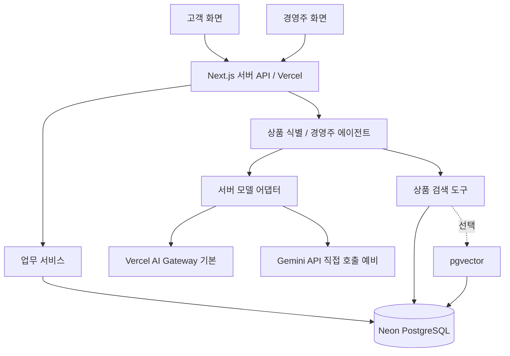

# 시스템 아키텍처 기준선

상태: 계정·실행 검증 전 기술 기준선. 서비스 선택은 환경 검증 결과에 따라 변경 기록을 남기고 조정할 수 있다.

## 구성



| 영역 | 기준선 | 목적 |
|---|---|---|
| FE | Next.js/React + TypeScript | 고객·경영주 화면 |
| BE | Next.js Route Handlers, Node.js runtime | 검증·업무 서비스·LLM 호출 |
| 저장소 | 하나의 Git 저장소 | FE/BE 타입·계약 동기화 |
| 배포 | 하나의 Vercel 프로젝트 | 관리 지점 축소 |
| DB | Neon PostgreSQL | 공통 상태·트랜잭션·선택 벡터 |
| 모델 호출 | Gateway 기본 + Gemini 직접 호출 | 무료 잔량 부족 시 검증한 예비 경로로 전환 |
| 검색 | 별칭·속성·키워드 + LLM | 기본 기능 |
| 임베딩 | 접근 가능한 모델 + pgvector | 선택 실험 |

정확한 Next.js·ORM·테스트 도구 버전은 구현 시 선택하고 lockfile로 고정한다. ORM은 트랜잭션·조건부 갱신·필요한 SQL을 지원해야 한다. 선택 자체를 새 제품 요구사항으로 만들지 않는다.

## 코드 경계 예시

```text
app/
  customer/             고객 화면
  merchant/             경영주 화면
  api/                  얇은 요청·응답 계층
src/
  domain/               상태·금액·발주·배정 규칙
  services/             DB와 도메인 규칙을 연결하는 사용 사례
  agents/               역할별 지시문·도구·응답 스키마
  search/               기본 검색·선택 벡터 검색
  db/                   스키마·쿼리·마이그레이션 연결
  contracts/            API 입력·출력 검증
  demo/                 고정 시나리오·모의 시계·공급·결제
scripts/                seed·검증·내보내기
tests/                  단위·통합·E2E·평가
docs/                   이 설계 문서
```

## FE/BE 관리

- FE는 사용자 입력과 화면 상태를 관리한다. 최종 가격·권한·재고·마감 판단은 서버가 한다.
- Route Handler는 세션·입력 검증 후 서비스를 호출한다. 업무 규칙을 화면이나 라우트마다 복제하지 않는다.
- 도메인 함수는 LLM·브라우저 없이 단위 테스트할 수 있게 한다.
- 에이전트는 한정된 검색/제안 도구를 사용한다. 모델에 DB 관리 권한을 제공하지 않는다.
- 서버 비밀정보는 클라이언트 번들에 포함하지 않는다. `NEXT_PUBLIC_` 변수에 DB·모델 키를 넣지 않는다.
- 실제 로그인은 MVP 필수로 확정되지 않았다. 데모 역할이라도 서버 세션으로 범위를 확인한다.

## 서버리스에 맞춘 실행

Vercel 함수 메모리·로컬 파일은 거래 상태 저장소로 가정하지 않는다. 요청 상태와 실행 결과는 DB에 저장한다. 브라우저 `localStorage`는 작성 중 입력·UI 설정 정도에만 사용한다.

- LLM 작업은 요청 안에서 끝낼 수 있는 제한된 실행으로 시작한다.
- 함수가 응답한 뒤 잊힌 비동기 작업이 계속 실행될 것이라고 가정하지 않는다.
- 필요하면 실행 레코드와 재시도 API로 복구한다. 장기 내구성 작업 큐는 후속 확장이다.
- 경영주 검토는 버튼·새 요청·모의 조건 변경 등의 이벤트에서 실행한다.
- 앱 내 알림은 DB에 저장하고 화면이 열렸을 때 조회한다. 상시 WebSocket 서버나 실제 푸시를 전제하지 않는다.
- DB와 함수 지역을 가능한 가까이 배치한다. 실제 제공 지역을 확인한 뒤 선택한다.

## 데모 세션

거래 레코드에 `demo_session_id`를 연결한다. 한 데모의 고객·경영주 화면은 같은 세션을 공유하지만 다른 심사자의 시연과 분리한다. 가상 시계 오프셋도 세션별로 두고 모든 서버의 시간 판정에서 동일한 clock 함수를 사용한다. 공용 서버의 실제 시각이나 다른 세션 시간을 변경하지 않는다.

## 배포 모드

| 모드 | 사용 목적 | 완료 증거 |
|---|---|---|
| 실제 LLM + DB | 최종 통합·자연어 검증 | 실제 호출과 DB 결과 |
| 고정 응답 + DB | 반복 업무/E2E 테스트 | 시나리오 재현, AI 품질 증거 아님 |

LLM 접근 실패를 고정 응답으로 숨겨 완료 선언하지 않는다. 두 모드에서 거래 로직은 동일하게 사용한다.

## 현재 필요하지 않은 구성

별도 AWS 서버, 별도 FastAPI/Nest 서버, 전용 벡터 DB, Redis, Kubernetes, 상주 개인 PC, 실제 결제/문자/지도 서비스 계정은 현재 기준선의 선행조건이 아니다. 새로운 기능이나 운영 요구가 생기면 근거를 기록하고 추가한다.

## 세션 격리와 병렬 개발 보완

상품·점포 공통 마스터는 읽기 전용으로 공유하는 기술안을 권장한다. 변경 가능한 가격·공급 조건·정책·예산·대화·제안은 세션 소유 또는 overlay로 분리한다. 거래 레코드에만 session ID를 붙이는 것으로 BR-34가 충족되지 않는다. reset 이전 실행의 늦은 쓰기를 세대 번호 등으로 거절한다. 정확한 계약은 R-17~R-20에서 확정한다.

FE/BE의 공통 계약·DB 마이그레이션·lockfile은 단일 작성자가 관리한다. 영역별 구현자와 독립 검증자, 단계적 통합 담당은 [개발 루프](14-agent-development-loop.md)의 소유권/DAG를 따른다. 이는 별도 런타임 서버를 추가하는 구조가 아니다.

## 서버리스 시간 예산

초기 구축에서 현재 Vercel 플랜/runtime의 최대 실행시간을 공식 문서와 실제 설정으로 확인한다. 지원되는 `maxDuration`을 상한 안에서 명시하고 모델 호출 timeout·도구 반복 상한·DB 작업·응답 전송 여유의 합이 그보다 작게 되도록 설계한다. 웹 조사·개발 실험 에이전트의 장시간 작업을 앱 요청 한 번의 서버리스 함수에 넣지 않는다. timeout 뒤 상태 확인·재시도는 동일 멱등 키로 처리하고 성공을 추정하지 않는다.

## 모델 제공자 설정

[25번](25-model-budget-and-fallback.md)의 서버 어댑터에서 Gateway와 Gemini 직접 호출을 선택한다. 도메인·권한·거래 코드는 공유하며 두 제공자의 구조화 출력은 같은 스키마로 검증한다. 서버 설정과 실제 제공자·모델을 실행 기록에 남긴다. 설정 변경으로 재배포가 필요하면 새 배포에서 검증하며 진행 중 거래는 멱등 키로 보호한다.

## Neon 도입 범위

Neon 계정 후속 설정은 [28번](28-neon-setup-guide.md)을 따른다. 현재 Neon의 역할은 PostgreSQL이며 Next.js FE·BE는 Vercel에서 실행한다. Neon의 AI Gateway는 현재 사용하는 Vercel AI Gateway와 다른 서비스이므로 `neon.ts` 예시를 근거로 LLM 경로를 바꾸지 않는다. CLI/MCP는 개발 관리 도구이고 앱 런타임 연결을 대신하지 않는다.
