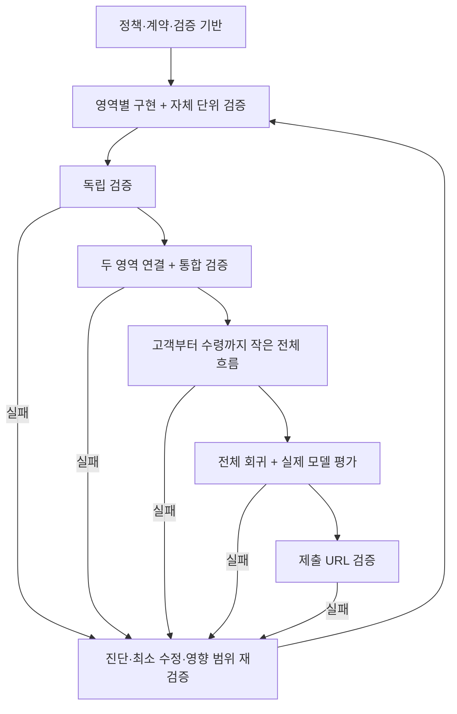

# 서브 에이전트 개발·검증 루프

상태: 개발 절차. 앱·테스트 실행기·CI는 구현 전이다. GATE-BOOTSTRAP에서 테스트 실패 시 병합과 배포를 차단하는 검증 장치를 만든다. 문서 검토와 제품 동작 검증은 별도로 기록한다.

## 원칙과 적용 범위

기능 영역별로 구현 책임을 나누고, 각 영역의 단위 검증을 통과한 결과만 단계적으로 통합한다. 부모 단계는 자식 단계의 성공을 합산하지 않고 연결된 동작을 다시 검증한다. 독립 검증자가 구현자의 주장과 다른 관점에서 명세·반례·실행 증거를 확인한다.

함수 하나마다 에이전트를 만들지 않는다. 독립적인 입출력 계약과 테스트 가능한 책임이 있는 작업에 하나의 구현 에이전트를 배정한다. 단순 카피 수정에 DB/E2E 전체를 반복하지 않되, 거래·권한·시각·계약 변경은 해당 통합 경로까지 재검증한다. 미정 정책은 17번의 ADR·두 독립 검토·채택을 거쳐 기대값으로 고정한다. 미정이라는 이유만으로 사람에게 묻고 중단하지 않는다.

제품 안에서 실행되는 고객/경영주 LLM 에이전트와, 코드를 개발하는 아래 서브 에이전트는 별개다. 개발 서브 에이전트를 Vercel에 상주시키지 않는다.

조정자는 [20번](20-agent-roles-and-context.md)의 역할과 Context Manifest를 사용한다. 역할명은 책임을 뜻하며 전부 동시에 실행하는 프로세스 수가 아니다. 모든 task는 현재 `manifest_id/hash`, CORE/결정, schema/seed/prompt/eval 버전, branch/base SHA를 소비하고 결과에 `consumed_context_hash`와 산출물 출처·변경 이력을 반환한다. 정책·계약 변경 통지를 ACK하지 않은 결과는 stale이다.

## 역할

| 역할 | 책임 | 넘겨야 하는 결과 | 제한 |
|---|---|---|---|
| 조정자 | 의존성 DAG·결정·소유권·검증 상태 관리, 인계 | 작업 계약, 통합 순서, PROGRESS | 자기 판단만으로 실패 게이트 해제 금지 |
| 영역 구현자 | 한 영역 구현·자체 단위 테스트·필요한 어댑터 검증 | 변경 파일, 계약, 명령/결과, 남은 위험 | 다른 소유 영역·공통 스키마 무단 수정 금지 |
| 독립 검증자 | 명세와 결과 대조, 반례·누락·실행 증거 확인 | PASS/FAIL/BLOCKED, 재현 사례, 근거 | 같은 작업의 구현자와 동일 에이전트는 독립 검증으로 계산하지 않음 |
| 통합 담당 | 검증된 자식 연결, 계약·DB·UI 일치 확인 | 통합 변경과 다음 레벨 검증 | 자식 PASS만 보고 부모 PASS 부여 금지 |
| 복구 담당 | 재현·원인 분류·영향 범위·수정안 | 실패 보고서, 회귀 사례, 복구 제안 | 정책 초안 제안 가능, 단독 채택·사용자 불변식 변경·무한 재시도·게이트 우회 금지 |
| 릴리스 검증자 | 제출 URL·실제 DB/모델·초기화 확인 | 최종 증거와 제한 | fixture를 live로 인정 금지 |
| customer-qa | 고객 모바일 독립 브라우저 검사 | 입력·확인·동의·상태·예외·회복 증거 | customer UX/FE/BE 구현자와 분리 |
| merchant-qa | 경영주 데스크톱 독립 브라우저 검사 | 묶음·자연어 수정·승인/정책·예외 부담 증거 | merchant UX/FE/BE 및 customer-qa와 분리 |
| method-auditor | 계획·역할·맥락·실험·게이트 운영 감사 | 구체적 공백·최소 개선·처분 | [22번](22-orchestration-audit.md)의 단일 depth 1, 하위 감사자 생성 금지 |

가용 슬롯 안에서 역할을 나누어 순차 또는 병렬로 실행한다. 현재 작업 환경에서는 조정자 포함 최대 4개가 가용하므로, 구현자 2명 + 검증자 1명 또는 구현자 1명 + 검증자 1명 + 복구 담당 1명으로 운용할 수 있다. 향후 환경의 실제 한도를 우선한다. 사용할 수 없는 서브 에이전트 기능을 존재한다고 가정하지 않는다.

## 작업 시작 계약

[작업 계약 템플릿](templates/task-contract.md)을 사용한다. 작업 ID, 적용 CORE/결정/AC, Context Manifest hash, 상위 의존성, 필요한 실행 시점 조사, 입출력·오류·권한 계약, 수정 허용 파일, 금지 범위, 반례, 통과 기준, 증거 위치, 독립 검증자를 정한다. 하위 작업은 부모 계약에 대한 자체 완료 조건이 있어야 한다.

- goal 실행 당시의 최신 조사는 계획 문구나 과거 링크로 대체하지 않는다. 초기 데이터뿐 아니라 각 기능 설계 전 고객/경영주 필요, UX·오류/복구, 기술 통합과 테스트 방식에 필요한 공식 자료를 조사하고 주장→설계/데이터/테스트 매핑을 G0 증거에 남긴다.
- 조사는 task 결정에 필요한 질문과 중단 조건을 먼저 정한다. 관련 출처가 stale이거나 통합 실패가 전제를 깨면 해당 조사만 갱신한다. 끝없는 일반 시장 조사, 소수 예시를 전체 데이터로 복제, 범위 밖 기능 확장은 허용하지 않는다.
- `민음사 빵` 같은 사용자 제시 사례는 조사 질문의 하나일 뿐 고정 seed 목표가 아니다. goal 실행 시 직접 확인하고, 미검증이면 `unverified_candidate`/미식별 사례로 유지한다.

- 공통 API·이벤트·상태·데이터 스키마의 소유자는 한 명으로 둔다.
- 계약 변경 요청은 조정자에게 전달하고 영향받는 소비자를 식별한 후 버전을 갱신한다.
- 공유 작업 폴더에서는 수정 파일을 겹치지 않게 예약한다. lockfile, migrations, 공유 fixture, 공통 타입은 단일 작성자가 변경한다.
- Git이 구성되면 격리 브랜치/작업 트리를 사용할 수 있다. 격리되어도 공통 계약 충돌은 사라지지 않는다. 통합 담당자가 직렬로 반영한다.
- 에이전트 중단·재시작 전에 실행 중 프로세스, 파일 변경, 작업 소유권을 확인한다. 이전 실행이 끝나기 전에 같은 작업을 중복 발행하지 않는다.
- 구현자가 자체 테스트도 작성하되, 독립 검증자는 요구사항에서 기대값을 도출한다. 구현 코드를 그대로 복사한 테스트는 핵심 검증으로 인정하지 않는다.

## 권장 영역 분할과 의존성

| 영역 | 책임 | 선행 계약 | 최소 검증 |
|---|---|---|---|
| F: 기반 | 스키마·세션·권한·시계·seed·테스트 실행기 | 기술 기준선 | seed 무결성, 타 세션 접근 거절, 시계 경계 |
| C: 고객 요청 | 상품 확인·동의·요청 생성/수정/취소 | F, 관련 제품 결정 | 재전송, 동의 변경, 경합 |
| S: 상품 식별 | 후보 검색·질문·미식별·실제 모델 | F, 후보 출력 계약 | 정답/모호/없음, 스키마, eval |
| M: 경영주 | 미확보 묶음·자연어 수정·승인 정책 | F/C, 정책 계약 | 이번만/지속, 범위 제한, 오래된 제안 |
| O: 발주 | 최소량·묶음·예산·수요 연결 | F/C, M의 제안 계약 | 초과 금지, 중복 발주, 동시 예산 |
| R: 이행 | 공급·FIFO 배정·모의 결제·예약·입고·48시간 수령 | F/C/O, 정책 결정 | 동시 배정, 실패/재시도, 정확한 기한 |
| U: 화면 통합 | 고객/경영주 흐름과 상태·오류 표시 | 소비할 API 계약 | 역할 간 일치, 새로고침, 오류 후 회복 |

R이 크면 배정/결제와 입고/픽업을 하위 작업으로 나눈다. FE 담당은 API 계약 fixture로 먼저 작업할 수 있으나, 실제 BE 연결 전에는 통합 완료가 아니다. F 전체를 기다리기보다 확정된 계약 단위로 해제하되 데이터 변경은 단일 소유권을 유지한다.

## 준비 표지와 게이트의 관계

`PLAN-READY`, `SEED-MIN-READY`, `SEED-READY`는 구현 순서를 통제하는 준비 상태 표지이며 G0~G6를 새 이름으로 대체하지 않는다.

- `PLAN-READY`: repeat/reuse preflight와 실제 Preview shell 결과를 반영한 순환 없는 DAG, 소유권, 현재 조사 질문, 결정 시점, 데이터/eval 보호, 검증·릴리스 경로가 구체화된 상태. 각 기능 G0는 이후에도 별도로 필요하다.
- `SEED-MIN-READY`: ADR-001의 최소 seed/importer를 실제 DB와 독립 검토로 검증한 상태. P04와 함께 F00 시작 조건이며 전체 데이터·정식 QA 완료를 뜻하지 않는다.
- `SEED-READY`: schema/migration 뒤 재현 가능한 seed가 실제 DB에서 검증되고, 약 200개 상품·8~12개 검증 점포 좌표·합성 actor/scenario·eval split/lineage가 같은 버전으로 묶인 상태. 데이터가 존재한다는 주장만으로 G2를 통과하지 않는다.
- 최초 PLAN-READY는 실행기를 만들기 위한 계획이므로 실제 Preview·조사·DAG를 바탕으로 별도 검토자가 근거와 판정을 기록한다. 실행기 존재를 선행조건으로 요구하지 않는다. GATE-BOOTSTRAP이 완성되면 같은 계획을 manifest/check로 재검사한다. SEED-READY는 실행기와 실제 seed 검사 결과를 요구한다. 현재의 빈 체크리스트 자체는 PASS 산출물이 아니다.

## 검증 게이트

| 게이트 | 실행 대상 | 통과 기준 | 통과 후 가능한 일 |
|---|---|---|---|
| G0 계약·준비 | 해당 정책·API·상태·테스트 환경·실행 시점 조사 | 필요한 결정, 조사 주장→설계/데이터/테스트 매핑, 반례와 기대값, Context hash와 소유권 확정 | 해당 영역 구현 |
| G1 영역 단위 | 순수 업무 함수, 검증 스키마, 핵심 UI 상태 | 타입/정적 검사 및 정상·경계·불법 전이 검증, 독립 검토 | 자식 통합 후보 |
| G2 영역 통합 | 서비스+실제 테스트 DB, route+권한, 어댑터 | 제약/rollback/중복/경합/세션 격리, 실제 계약 일치 | 영역 간 연결 |
| G3 영역 간 통합 | 요청↔발주, 발주↔배정, 배정↔결제, 예약↔입고↔수령 | 각 경계의 성공·실패·재전송·조건 변경, 수량 보존 | 수직 흐름 연결 |
| G4 수직 흐름 | 고객→경영주→고객 브라우저 | fixture E2E와 필요한 live 기준선, customer-qa/merchant-qa 독립 결과, 저장 상태·알림·타임라인 대조 | 범위 확대 |
| G5 전체 시스템 | exact release candidate head의 적용 AC, 전체 회귀, 자연어 eval | 최신 제출 base와의 조합 SHA에 배포 전 필수 기준 통과, AC-19 최종 URL 확인은 G6 대기, live/fixture 별도 증거, build 성공 | `main` 병합 후보 |
| G6 배포 검증 | `main` merge SHA에서 생성된 실제 제출 Vercel URL | deployment source/DB schema/seed/model/환경 일치, live 모델·두 역할 브라우저·reset·핵심 예외 확인 | 제품 완료 보고 |

배포 실행의 선행조건은 G5까지이며 최종 완료 판정은 G6까지다. AC-19의 제출 URL 검증은 배포 후 G6에서 수행한다. 아직 실행하지 않은 게이트 자신의 결과를 그 게이트 실행의 선행조건으로 요구하지 않는다. fixture는 해당 모드의 G1~G4 검증에 사용할 수 있으나 live 필수 기준이나 최종 완료를 대체할 수 없다.

G1/G2는 해당 레벨에 의미 있는 대상만 실행한다. 예를 들어 순수 표시 컴포넌트에 독자 DB 검증을 강요하지 않되, `not_applicable` 사유와 통합 시 확인할 상위 게이트를 기록한다. `skipped`, `blocked`, `flaky`는 PASS가 아니다. 필수 AC와 거래 경로를 `not_applicable`로 빼는 것은 범위 변경이므로 임의로 하지 않는다.

예: 과거 단위 실행은 12 PASS여도, 현재 변경 영향이 미검증이고 독립 검증/DB가 없으면 현재 게이트는 BLOCKED다. 원본 테스트 결과, 증거 유효성(stale/미확인), 게이트 진행 상태를 서로 덮어쓰지 않고 따로 기록한다.

각 부모 단계는 자식들의 유효한 PASS와 자신의 새 테스트 결과를 모두 요구한다. 테스트 한 번 성공할 때까지 재실행한 뒤 앞선 실패를 숨기지 않는다. 비결정적 live eval은 사전 고정한 사례·반복수·판정 기준을 사용한다.

## 증거와 변경 후 무효화

[게이트 보고서](templates/gate-report.md)에 아래를 남긴다.

- task ID, gate, AC/업무 규칙, 기대값과 실제 결과, 검증자.
- Git revision + 미커밋 변경의 content hash, 또는 Git 미구성 시 대상 파일 manifest/hash. HEAD만 같다고 같은 코드로 보지 않는다.
- 계약/스키마/migration/seed 버전, 환경과 모델·프롬프트 버전, live/fixture, 테스트 데이터·시계 설정.
- 실행 명령, 시작/완료 시각, 종료 코드, 실패/스킵 수, 원본 결과 파일 경로. 명령 성공만으로 테스트 0개를 PASS 처리하지 않는다.
- 자식 증거 ID와 부모 통합 증거, 재현 절차, 남은 제한.

코드·정책·스키마·seed·모델/프롬프트가 바뀌면 영향받은 결과는 `stale`이다. 수정 영역부터 의존하는 부모 게이트까지 다시 확인한다. 금액/수량/권한/기한/공통 계약 변경은 관련 거래 경로 전체를 포함한다. 변경과 무관한 성공 테스트는 근거 없이 반복하지 않는다. 배포 환경변수 변경도 관련 연결/배포 증거를 무효화한다.

## 자동 검증 장치: GATE-BOOTSTRAP

앱 개발 초기에 별도 작업으로 다음을 구현한다. 여기 적힌 파일명은 설계안이며 아직 존재하지 않는다.

1. `quality/gates.json`: 작업 의존성, 필수 AC, 적용 게이트, 기대 테스트 집합, 증거 fingerprint를 선언한다. 업무 정책의 원본은 docs에 유지한다.
2. `scripts/check-gates.*`: 실제 테스트 실행 결과와 산출물을 읽어 실패·미실행·스킵·0개 실행·stale·누락된 자식·미완료 독립 검증이면 nonzero로 종료한다. 임의 `passed: true` 기록만 믿지 않는다.
3. 테스트 실행 명령을 `package.json`에 고정하고, 통합/릴리스 명령의 선행조건으로 게이트 검증을 연결한다. 인프라 최소 기본 동작 검사 배포는 제품 완료와 별도 경로로 구분한다.
4. 조정자가 증거 갱신과 통합을 직렬화한다. GitHub 연결을 전제로 CI와 가용 권한 안의 required checks/배포 연계를 구성한다. 실제 권한이 없으면 외부 차단을 기록하며 로컬 검사만으로 원격 강제가 있다고 주장하지 않는다.
5. 실행기 자체를 반례로 검증한다: 이전 revision의 PASS, 테스트 0개, 실패한 자식, fixture-only live 요구, 누락된 증거, 같은 구현자/검증자, 변조된 결과를 입력했을 때 통합을 거절해야 한다. 서명 없는 로컬 파일만으로 악의적 변조 방지까지 보장하지 않는다.

이 작업이 끝나기 전 상태는 ‘규칙 문서화 완료 / 자동 강제 미구현’이다. 독립 에이전트 슬롯이 없으면 대기·순차 검증을 사용한다. 기능이 아예 없으면 자체 검증을 독립 검증으로 표시하지 않고 해당 게이트의 한계를 보고한다. 그동안 독립적인 구현 준비는 계속할 수 있다.

## 자연어 실험의 게이트 연결

[23번](23-nl-experiment-loop.md)의 목적은 필수 오류 0건과 출시 최소 기준을 지키면서 고객 상품 식별/확인/미식별 및 경영주 intent/scope/조건 품질을 사전 고정한 validation 지표에서 개선하는 것이다.

- 기준선 이후 고객 최대 6개, 경영주 최대 6개, 전체 최대 12개 후보만 평가한다. 같은 역할에서 연속 3개 후보가 개선 기준을 충족하지 못하면 그 역할 최적화를 중단한다.
- 평가자가 후보와 분리된 grouped validation/holdout으로 판정한다. evidence-backed 발화와 synthetic utterance를 구분하고 family `group_id`를 split 사이에 흩뜨리지 않는다.
- 출시 최소 기준을 통과한 최선 버전을 보존한다. 후보가 악화되면 되돌리고, plateau/budget-stop이면 출시 기준을 통과한 최선 버전으로 G5를 계속할 수 있다.
- 허구 SKU, 권한/동의, 수량·금액, 48시간 같은 mandatory 오류는 후보 한도나 최적화 포기로 면제할 수 없다. 모든 버전이 최소 기준 미달이면 G5는 FAIL/BLOCKED다.

## 실패·종료·인계

실패 시 [복구 절차](15-failure-recovery.md)를 따른다. 도구/goal의 실제 수명주기 규칙이 이 문서보다 우선하며, 작업 상태 `blocked`를 도구의 goal 상태와 혼동하지 않는다. 재시작 시 PROGRESS → 실패 기록 → 작업 소유권 → 마지막 유효 게이트를 읽고 이어간다. 성공한 하위 작업만 완료로 유지하고 실패한 상위 연결을 완료 처리하지 않는다.

## 정책·Git 연결

G0 정책은 [17번](17-autonomous-decisions.md)으로 해결한다. 제품 원칙과 상태/실패 검토자 두 명이 제안자와 별도로 검토하고 조정자가 위임 정책으로 채택한다. 정책 검토와 구현 테스트는 다른 증거다.

통과 단계는 [16번](16-git-and-release-workflow.md)의 commit/push·PR로 남긴다. 작업→통합에는 현재 적용 게이트, 통합→제출에는 G5와 최종 정책 감사, 제출 배포 뒤에는 G6를 요구한다. 새 통합 기반에 영향받는 검사·독립 판정을 갱신한다. 환경 사전점검 통과는 제품 테스트 통과를 대신하지 않는다.

## 초기 데이터 범위

[ADR-001](decisions/ADR-001-minimal-seed-development.md)에 따라 좌표 비의존 G1~G3와 최소 seed 사전 UX 검사는 전체 수집과 병행한다. 실제 좌표가 필요한 테스트는 개별 blocked/not_run으로 추적한다. 최소 seed의 U01/U02는 G4-ready이며 정식 Q01/Q02·G4는 전체 seed로 다시 검증한다. 게이트 보고서에는 seed 버전과 검사 범위를 기록한다.

## 목적 보존을 게이트에 연결

G0에서 [card.md](../card.md)의 사용자 결과·관련 CORE/AC·유지할 정상 사례를 작업 계약에 명시한다. GATE-BOOTSTRAP은 작업/실패/게이트 보고서의 해당 필드·증거 연결·독립 판정 누락을 검사하도록 구현한다. 형식 검사를 의미 검증으로 간주하지 않는다. 독립 검증자가 정상 결과와 실패 결과를 대조하고, 필수 기능을 제거해 통과한 변경은 FAIL로 판정한다.

각 단계는 구현된 범위에 맞게 검사한다. 초기 기반 작업은 기반의 기대 동작과 후속 기능 검증 경로를 제시하며 완제품 E2E를 선행조건으로 삼지 않는다. 영향 없는 유효 검사를 반복하지 않고, 기존 게이트를 면제하거나 새 중복 게이트를 만들지 않는다.
