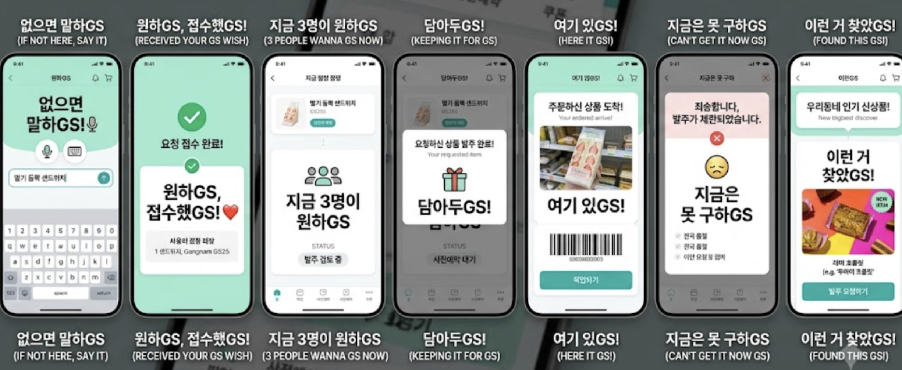
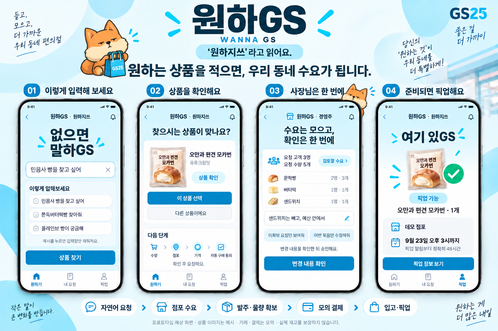

# 디자인·브랜드·화면 구현 가이드

최초 구현 기준. D-35/36/38·CORE-24·AC-30에 따른 디자인 지침이다. 이름은 **원하GS**, 발음은 **원하지쓰**, 영문은 **WANNA GS**다. 이 문서는 앞으로 만들 화면의 기준이며 현재 앱이 구현되었다는 뜻은 아니다.

## 참고 자료와 적용 범위



| 자료 | 관찰·채택할 요소 | 한계 |
|---|---|---|
| 사용자 제공 이미지, 2026-09-21 | 민트색 상단, 흰 둥근 카드, 큰 한글 제목, 상품 이미지, 짧은 상태 메시지, 하단 탐색 | 분위기·구성 참고. 이미지 속 기능·상태·영문·버튼이 요구사항을 바꾸지 않음 |
| [GS Retail 공식 App Store 소개](https://apps.apple.com/kr/app/id426644449), 2026-09-21 브라우저 확인 | 시안·블루 계열 강조색, 밝은 앱 바탕, 카드형 서비스/상품 구획, 매장 정보, 하단 탐색 | 공개 홍보 스크린샷을 관찰. 실제 로그인 앱 전체나 내부 디자인 시스템을 확인한 것은 아님 |
| [GS25 공식 소개](https://gs25.gsretail.com/gscvs/ko/store-services/woodongs?uiel=Mobile) | 공식 서비스 확인 경로 | 조회 시 새 브랜드 페이지로 이동했고 JS 본문을 읽지 못함. 세부 UI 근거로 사용하지 않음 |

공식 앱의 익숙한 상품·점포·픽업 배치를 참고하고, 원하GS에는 자연어 요청과 수요 상태를 중심으로 구성한다. 사용자의 후속 색상 지시에 따라 공식 앱 소개의 시안·블루를 우선한다. 최초 참고 이미지의 민트색은 현행 색상 기준이 아니다. 아래 HEX·치수는 이 프로젝트의 구현 시작값이며 공식 GS 디자인 토큰으로 주장하지 않는다. 공식 앱 전체 홈이나 결제·멤버십·쿠폰 기능을 복제하지 않는다.

참고 이미지는 docs에 보존하며 실행 화면 전체를 이미지로 붙여 기능처럼 보이게 하지 않는다. 화면의 글자·입력·버튼·상태는 실제 UI로 구현한다. 이미지에 있는 마이크, 카메라, 실제 바코드, 신규 상품 발굴 화면은 이번 범위에 추가하지 않는다. 입력은 한국어 자연어 **텍스트**다. 영어 부제와 기기 프레임도 앱 화면에 옮기지 않는다.

## 이름을 읽게 만드는 방법

`GS`의 영문 철자만 보고 의도한 말장난을 알아차린다고 가정하지 않는다. 첫 화면에서 다음 두 줄을 동시에 보여준다.

```text
원하GS
‘원하지쓰’라고 읽어요.
```

이 안내는 진입을 막는 팝업이나 자동 사라지는 토스트가 아니다. 첫 고객 진입 화면의 브랜드 아래에 14px 이상으로 남긴다. 재방문 시에도 브랜드 영역 또는 이름 안내에서 발음을 다시 볼 수 있다. 경영주 첫 화면도 `원하GS · 원하지쓰`와 `경영주` 역할을 표시한다. 제출 소개 첫 줄에는 `원하GS(원하지쓰) · WANNA GS`를 쓴다.

| 위치 | 표시 예시 | 기준 |
|---|---|---|
| 첫 고객 화면 | 원하GS / ‘원하지쓰’라고 읽어요. | 로고와 설명을 한 구획으로 배치, GS만 과하게 분리하지 않음 |
| 입력 화면 제목 | 없으면 말하GS / 없으면 말하지쓰 | 첫 소개에는 읽는 법을 짧게 병기. 모든 문장에 반복해 화면을 채우지 않음 |
| 이후 상단 | 원하GS · 원하지쓰 | 좁으면 두 줄 배치, 한 단어 중간 줄바꿈 방지 |
| 페이지 제목 | 원하GS(원하지쓰) — 내 요청 | 직접 링크로 들어와도 브랜드 식별 가능 |
| 고객 행동 버튼 | 상품 찾기 / 이 상품 선택 / 요청하기 / 내 요청 보기 | 행동을 명확한 한국어로 표기 |
| 경영주 행동 버튼 | 선택한 항목 발주 승인 / 변경 내용 확인 | 승인 범위와 결과가 읽혀야 함 |

`~GS`는 원하GS 카피 안에서 `~지쓰`로 읽도록 안내한다. `원하지쓰`는 확정 발음이다. 다른 카피의 발음 예시는 12번에서 관리하고 어색한 문장은 억지로 늘리지 않는다. GS25·우리동네GS 같은 실제 고유명사까지 일괄 치환하지 않는다. 기존 제안 발음은 현행 UI·설명에 사용하지 않는다.

브랜드와 발음 안내는 이미지 안 글자나 hover 툴팁만으로 전달하지 않는다. 실제 텍스트로 노출한다. 접근성 이름을 지정할 경우 `원하GS, 원하지쓰 홈`처럼 보이는 이름을 포함하고 발음을 덧붙인다. `aria-label="원하지쓰"`만으로 보이는 이름을 대체하지 않는다. 음성 읽기는 기기마다 달라 자동 발음 보장을 주장하지 않으며 실제 화면 읽기 순서도 확인한다. 별도 음성 재생 기능은 요구하지 않는다. [W3C 보이는 라벨과 접근성 이름](https://www.w3.org/WAI/WCAG22/Understanding/label-in-name.html).

## 색상·글자·간격

브랜드 영역은 밝은 시안, 정보 영역은 흰색, 중요한 행동은 짙은 블루으로 구분한다. 첫 진입·접수·픽업 화면에 큰 카피를 쓰고 목록·경영주 업무 화면에서는 수량·금액·상태가 먼저 읽히게 한다.

| 토큰 | 시작값 | 용도 |
|---|---|---|
| brand-accent | `#00B9D6` | 장식·브랜드 강조. 흰 본문 배경으로 사용하지 않음 |
| brand-soft | `#E3F7FC` | 첫 화면 상단·작은 브랜드 배경 |
| brand-action | `#007A9E` | 주 행동 버튼, 흰 글자와 조합 |
| brand-ink | `#123344` | 밝은 시안 위 제목 |
| page | `#F5F9FC` | 전체 바탕 |
| surface | `#FFFFFF` | 상품·상태·동의 카드 |
| text | `#172B3A` | 본문·금액·제목 |
| text-secondary | `#526575` | 설명·보조 정보 |
| border | `#D9E5ED` | 장식 구분선. 입력/포커스 식별은 이 선에만 의존하지 않음 |
| caution | `#8A4B00` / `#FFF3DF` | 대기·검토 필요 글자/배경 |
| error | `#B42318` / `#FFF0EE` | 실패·기한 종료 글자/배경 |

- 밝은 시안 위에는 짙은 글자, 진한 버튼 위에는 흰 글자. 밝은 시안 위 흰 본문은 피한다. 일반 텍스트 대비 4.5:1 이상, 큰 텍스트 3:1 이상을 검사한다. 색만으로 성공/실패를 구분하지 않는다. [W3C 텍스트 대비](https://www.w3.org/WAI/WCAG22/Understanding/contrast-minimum.html).
- 폰트 시작값은 `system-ui, "Apple SD Gothic Neo", "Malgun Gothic", sans-serif`. 추가 웹폰트는 사용 가능 파일·라이선스를 확인한 경우에만 로컬 자산으로 적용하며 기본 폰트에서도 흐름이 유지돼야 한다.
- 브랜드 제목 28~32px/700, 화면 제목 22~24px/700, 본문·입력 16px, 보조 14px. 본문 줄높이 1.5. 상품·점포명과 마감은 임의 생략하지 않고 여러 줄을 허용한다.
- 간격은 4/8/12/16/24/32px, 모바일 좌우 여백 20px, 카드 안쪽 16~20px, 카드 모서리 16~20px. 얇은 선과 약한 그림자를 사용하며 모든 카드에 그림자를 겹치지 않는다.
- 주요 버튼 높이 48px 이상, 보조 터치 영역 44px 이상을 프로젝트 기준으로 삼는다. 키보드 포커스는 선명한 외곽선과 여백으로 표현한다.
- 상태 아이콘은 체크·시계·안내 등 단순한 형태로 통일한다. 하트·이모지는 환영/접수에 제한적으로 쓰고 결제 실패·기한 초과에는 원인과 다음 행동을 우선한다.

## 고객 화면 구성

모바일 우선으로 만든다. 390px 폭을 기본 설계 크기로 삼고 360px에서 가로 스크롤 없이 확인한다. 넓은 화면에서는 약 480px의 읽기 폭을 유지할 수 있으나 가짜 휴대전화 테두리를 기능 화면에 강제하지 않는다. 하단 탐색 기본안은 `원하기 / 내 요청 / 픽업` 세 항목이며 경영주 전환은 별도 데모 역할 선택에 둔다. 앱 키보드·safe area·하단 탐색이 입력이나 주요 버튼을 가리지 않게 한다.

```text
원하GS · 원하지쓰                         알림
없으면 말하GS
찾는 상품의 이름이나 특징을 알려주세요.
[ 자연어 입력                              ]
[ 상품 찾기                                ]
예시: 딸기랑 크림이 들어간 샌드위치
내 요청 요약                       [전체 보기]
────────────────────────────────────────────
원하기                 내 요청                픽업
```

예시는 입력만 채운다. 요청/발주가 자동 실행되지 않는다. 알림은 구현된 앱 내 알림으로 연결하고 장식용 아이콘·작동하지 않는 장바구니를 추가하지 않는다.

| 화면 | 정보 순서 | 주요 행동·오류 회복 |
|---|---|---|
| 입력 | 브랜드/발음 → 짧은 제목 → 항상 보이는 입력 라벨 → 예시 → 찾기 | 한글 조합 중 Enter로 제출하지 않음. 검색 중 중복 제출 방지, 오류 시 입력 보존·재시도 |
| 후보 확인 | 검색 의도 → 상품 이미지/이름·맛·용량 → 후보 차이 | `이 상품 선택`, `다른 상품이에요`. 확신 없는 후보를 자동 확정하지 않음 |
| 수량·점포·동의 | 선택 상품 → 수량 → 점포/거리·목록/지도 → 가격·총액 → 자동 구매/48시간 조건 | 동의 내용을 읽고 요청하기. 지도 실패 시 목록으로 선택 유지 |
| 요청 접수 | 접수 제목 → 정확한 상태 → 상품·수량·점포 → 내 요청 보기 | ‘아직 물량 확보 전’ 명시. 대형 성공 팝업을 연속으로 띄우지 않음 |
| 내 요청 상세 | 상태 배지 → 한 줄 설명 → 상품·수량·점포 → 단계·최근 갱신 → 가능한 행동 | 서버 상태로 타임라인 구성. 미래 단계는 대기로 구분 |
| 예약 확정 | 모의 결제/예약 상태 → 예약 상품·점포 → 입고 대기 설명 | ‘담아두GS’는 이 단계에서 사용. 아직 수령할 수 없음 |
| 픽업 가능 | ‘여기 있GS’ → 수령 점포 → 정확한 마감 날짜/시각·남은 시간 → 모의 예약번호 | `픽업 정보 보기`. 고객이 누르는 구매 재확정 단계는 만들지 않음. 실제 수령 처리는 기존 경영주 흐름 유지 |
| 제한·실패·기한 종료 | 정확한 상태 → 확인된 사유 → 영향(미결제/예약 여부) → 가능한 다음 행동 | 모르는 사유는 확인 중. 실제 근거 없는 전국 품절·생산 종료 단정 금지 |
| 미식별 | 확인 불가 → 입력 보존 → 기록 상태 → 재입력/내역 | 상품 식별이 안 된 기록을 구매 요청·예약과 구분 |

공급 확보와 결제가 빠르게 연속되어도 이벤트/저장 상태를 합쳐 만들지 않는다. `발주 승인`, `공급 확인 중`, `모의 결제 실패`, `예약 확정`, `픽업 가능`을 화면이 구분해야 한다. 타임라인의 정확한 상태 매핑은 03/04번과 채택 ADR을 따른다. 정보성 화면은 카드로 표시하고 모달/하단 시트는 선택·동의처럼 집중이 필요한 순간에만 사용한다.

## 경영주 화면 구성

같은 색·글자·카드 컴포넌트를 쓰되 데스크톱 업무 밀도에 맞춘다. 상단에는 점포·역할·자동발주 설정 상태, 본문에는 `검토할 수요 / 미확보 / 미식별 / 입고·수령`을 구분한다. 한 줄 요약 → 예외 묶음 → 상품별 수요·발주·확보 수량 → 근거 → 선택한 항목의 합계와 승인 순서로 구성한다.

자연어 입력 옆에 ‘샌드위치는 빼고 예산 안에서’ 같은 예시를 두고 해석한 변경 내용을 실행 전에 보여준다. ‘이번 묶음’과 ‘앞으로의 자동발주 정책’을 명확히 나눈다. 성공 항목마다 팝업을 띄우지 않고 결과 요약과 예외만 펼친다. 좁은 화면에서는 표를 카드로 바꾸되 품목·수량·합계·승인 범위가 빠지지 않아야 한다. 브랜드 말장난은 짧은 제목에 제한하고 금액·승인·실패 사유는 평이한 한국어로 쓴다.

## 구현과 검증에 연결

- UX/FE 담당은 화면 작업 전에 첨부 이미지와 공식 앱 소개를 읽고 참고한 요소·확인일·이번 적용 범위를 기록한다. 최신 공식 화면이 달라졌다면 관련 참고만 갱신하며 사용자 브랜드·기능 정의는 유지한다.
- 색·타이포·간격 토큰, BrandLockup, 상품 카드, 상태 배지/타임라인, 기한 표시, 공통 버튼, 빈/로딩/오류 상태를 공유한다. 이름·발음·카피는 한 곳에서 관리한다. 구체적인 코드 파일 경로는 앱 초기 구축 때 정한다.
- 상태·기한·결제 결과·제한 사유는 서버의 정형 데이터에 연결된 카피 템플릿으로 표시한다. LLM이 성공 상태·숫자·기한을 새로 지어내지 않게 한다. 숫자 3명이나 예시 마감일을 고정하지 않는다.
- P02 최소 shell은 브랜드/발음과 기본 토큰을 보여준다. FC/FM·U01/U02에서 상태별 화면을 구현하고 Q01/Q02에서 AC-30을 독립 검증한다. G5/G6는 해당 최종 화면의 결과를 확인한다. 새 단계나 외부 디자인 도구 계정을 선행조건으로 추가하지 않는다.

| QA ID | 검사 | 통과 근거 |
|---|---|---|
| UX-B01 | 첫 고객·경영주 진입에서 발음 안내를 찾을 수 있는가 | 가시적인 ‘원하지쓰’, 브랜드와 가까운 배치, 실제 텍스트·접근성 이름 확인 |
| UX-B02 | 직접 내 요청/픽업 페이지로 들어와도 이름·역할을 알 수 있는가 | 공통 헤더·페이지 제목·화면 읽기 순서 |
| UX-B03 | 요청 접수/발주 승인만 된 상태를 예약/픽업으로 오해하게 하지 않는가 | 상태별 카피와 서버 이벤트 대조, 실패·지연 주입 포함 |
| UX-B04 | 모의 결제 실패·제한·만료에서 상태와 가능한 행동을 이해할 수 있는가 | 정상/실패 대조, 잘못된 성공 제목·근거 없는 사유 없음 |
| UX-B05 | 48시간의 시작·마감·종료 상태가 정확한가 | 픽업 알림 생성+48h, 서버 기준 직전/정각/직후, 재전송 시 불변 |
| UX-B06 | 360/390px 고객·1280px 경영주 화면과 200% 글자 확대에서 핵심 정보를 읽고 조작 가능한가 | 가림/잘림/가로 넘침·키보드/focus·색 대비·동적 상태 안내 확인 |
| UX-B07 | 이미지 속 제외 기능이나 장식용 버튼이 구현 범위로 들어왔는가 | 마이크/사진/발굴 화면 없음, 보이는 행동은 실제 연결됨 |

브라우저 DOM assertion·접근성 검사만으로 사람이 발음을 자연스럽게 이해한다고 증명하지 않는다. 독립 QA가 처음 본 화면 관점으로 브랜드 읽는 법·현재 상태·다음 행동을 설명할 수 있는지 검토한다. 실제 사용자 읽기 테스트를 하지 않았다면 인간 사용자 검증 완료로 보고하지 않는다. 발음 안내 누락·필수 상태 오인·핵심 조작 불가는 AC-30 실패이고, 단순 장식 취향은 필수 흐름을 해치지 않는 범위에서 개선한다.

## 입력 예시: 먼저 어떤 말을 할 수 있는지 보여주기

D-36에 따라 고객·경영주 입력란에 `이렇게 말해보세요` 예시를 둔다. 고객은 상품명·별칭·특징으로 찾을 수 있다는 점을, 경영주는 묶음에 조건을 적용할 수 있다는 점을 이해해야 한다. 예시는 placeholder만으로 전달하지 않고 입력란 옆의 실제 버튼/텍스트로 제공한다.

| 역할 | 예시 문장 | 보여줄 동작 |
|---|---|---|
| 고객 | 민음사 빵을 찾고 싶어 | 여러 종류가 있으면 맛·상품 후보로 확인 |
| 고객 | 쫀득버터떡빵 찾아줘 | 카탈로그에서 해당 후보 검색 |
| 고객 | 플레이브 빵이 궁금해 | 시리즈와 개별 SKU를 구분 |
| 고객 | 그 책갈피 들어있는 빵 찾아줘 | 확인된 특징으로 후보 제시. 특정 증정품 보장 금지 |
| 경영주 | 미확보 요청만 보여줘 | 조회만 수행, 발주·정책 변경 없음 |
| 경영주 | 샌드위치는 빼고, 예산 안에서 | 현재 묶음의 제외 조건·저장된 예산으로 변경안 생성 |
| 경영주 | 이번 묶음은 요청 수량만큼 제안해줘 | 조건·수량·금액을 표시한 제안. 승인으로 간주하지 않음 |

한 번에 고객 예시 3개 정도를 보여주는 구성으로 시작한다. 버튼을 누르면 입력만 채우고 `상품 찾기` 또는 `변경 내용 확인`을 눌러야 제출한다. 작성 중인 입력을 예시 교체나 자동 회전으로 덮어쓰지 않는다. 비어 있지 않은 입력의 예시 선택은 기존 입력을 복구할 수 있게 한다. 경영주 예시는 현재 점포·묶음·예산이 실제 존재할 때만 사용하고, 범위가 없으면 선택을 안내한다. 한글 조합 중 제출과 예시 버튼의 키보드 접근도 검사한다.

2026-09-21에 확인한 예시 소재:

| 소재 | 출처·발행일 | 해석 범위 |
|---|---|---|
| 민음사 빵 | [이투데이, 2026-08-26](https://www.etoday.co.kr/news/view/2618139) | 실제 협업 상품 사례. 현재 점포 재고나 모든 종류의 취급 보장 아님 |
| 쫀득버터떡빵 | [ZDNet Korea, 2026-04-03](https://zdnet.co.kr/view/?no=20260403085247) | 과거 출시·관심 사례. 지금 인기 순위라는 뜻 아님 |
| 플레이브 빵 | [ZDNet Korea, 2026-01-25](https://zdnet.co.kr/view/?no=20260125100343) | 과거 협업 사례. 현재 판매 여부는 별도 확인 |

위 문장들은 프로젝트가 만든 합성 발화이며 실제 고객 인용이 아니다. goal 실행 시 24번 조사와 19번 seed를 통해 소재를 다시 확인한다. 화면을 열 때마다 웹/LLM 호출을 하지 않고 검증한 예시 목록을 seed와 함께 배포한다. 일반 예시는 활성 카탈로그에 연결되는 상품을 사용하고 미식별 시연은 별도로 표시한다. 출처 URL·발행일·확인일·research_case_id·관련 상품/시나리오 ID·검토 상태를 관리한다. 오래된 기사만으로 ‘지금 인기’라고 쓰지 않는다.

공개 입력 예시는 dev/demo 데이터다. 같은 문장과 패러프레이즈 family를 독립 holdout으로 재사용해 성능을 부풀리지 않는다. 클라이언트에 평가 정답·비공개 holdout을 전달하지 않는다.

| QA ID | 검사 | 통과 근거 |
|---|---|---|
| UX-B08 | 예시의 입력 도움·출처·카탈로그 연결·평가 분리 | 예시 선택만으로 API 제출/요청 생성 없음, 기존 입력 복구, 실행 시점 소재 검토·dev 분리 |
| UX-B09 | 경영주 예시의 범위·변경 전 확인 | 현재 점포/묶음 표시, 이번만/지속 정책 구별, 예시 선택만으로 발주·정책 변경 없음 |
| UX-B10 | 캐릭터와 장식이 작업을 방해하지 않는가 | 입력·CTA·금액·기한 가림 없음, 장식 이미지는 중복 읽기 제외, 이미지 로딩 실패에도 기능 유지 |

## 홍보 시안과 캐릭터



[캐릭터 없는 색상 시안](assets/wanna-gs-promo-cyan.png)과 [생성 기록·프롬프트](assets/promo-generation-notes.md)도 보존한다. 이미지는 예상 화면이며 실행 증거가 아니다. 그림의 상품 포장·점포·수량·날짜는 예시이고 실제 UI는 DB 값을 표시한다. 앱 버튼의 실제 색 대비는 위 토큰으로 별도 검사한다.

사용자가 말한 ‘무지’와 관련해 GS리테일의 [2024-01-08 보도자료](https://www.newswire.co.kr/newsRead.php?no=982245)에서 확인한 GS25 캐릭터명은 **무무씨**이며 티베트 여우를 모티브로 한다(2026-09-21 확인). 이번 그림은 이를 참고해 생성한 컨셉 일러스트다. 공식 원본 에셋을 그대로 사용하거나 승인된 캐릭터 시안이라는 뜻은 아니다.

앱에서는 첫 소개나 빈 상태 등 정보가 적은 곳에 작은 보조 요소로 쓴다. 승인·결제 오류·마감 안내를 가리지 않으며 캐릭터 말풍선으로만 필수 정보를 전달하지 않는다. 캐릭터를 보기 위해 클릭하거나 닫아야 하는 단계를 추가하지 않는다. 경영주 작업 목록에는 반복 배치하지 않는다. 장식은 접근성 중복 읽기에서 제외하고 애니메이션 없이도 의미가 전달돼야 한다.

## 이미지를 코드 구현에 사용하는 goal 루프

D-39에 따라 [캐릭터 포함 최종 시안](assets/wanna-gs-promo-mascot.png)을 공통 시각 참고로 사용한다. 구현자가 색·정보 위계·브랜드 배치를 매번 새로 해석하는 일을 줄이는 데 도움이 된다는 판단이다. 효율 향상을 실제 개발 시간으로 측정한 결과는 아니다. 그림은 **디자인 방향과 비교 자료**이며 업무 규칙·데이터 정답이나 전체 화면 명세는 아니다.

이미지와 충돌하면 최신 사용자 결정·CORE·상태/업무/카피 명세가 우선한다. 아래 매핑을 함께 전달해 빠진 화면이나 정적 숫자를 기능으로 오해하지 않게 한다.

| 이미지 영역 | 구현에 참고할 요소 | 코드/데이터 기준과 보완 | 검증 |
|---|---|---|---|
| 포스터 상단 | 원하GS + 가시적 ‘원하지쓰’, 시안/블루, 작은 캐릭터 | 실제 텍스트 BrandLockup·공유 토큰. 홍보 문구·기기 프레임 전체는 앱에 복제하지 않음 | UX-B01/02/06/10 |
| 01 입력 | 입력 라벨·자연어 예시·하단 탐색 | 실행 시점 조사/활성 seed의 예시. 클릭은 입력만 채움 | UX-B08, AC-01/02 |
| 02 상품 확인 | 후보 카드·상품 차이·명확한 선택 버튼 | 정확/대체 후보 구분. 그림에 생략된 수량·점포·가격·동의 화면은 별도로 구현 | AC-04/11, VAL-01~03 |
| 03 경영주 | 수요 요약·자연어 수정·결과 확인 | 3명/5개는 예시. 실제 고유 고객/수량·예산·승인 범위와 성공/실패/보류를 표시. 데스크톱 업무 화면으로 확장 | UX-B09, AC-07/08/31 |
| 04 픽업 | 수령 가능·상품/점포·명확한 마감 | 예약/모의 결제/입고 상태 연결. 날짜는 서버 알림 생성+48시간에서 계산 | UX-B03~05, AC-12~15 |
| 그림에 없는 상태 | 없음 | 미식별·대체 거절·로딩/오류·빈 상태·공급 부족·결제 실패·만료·모의 수령도 명세대로 구현 | 09/21/27의 정상·예외 검사 |

### 작업 순서

1. **UX 계획/P02:** UX 담당이 이미지를 실제로 열어 보고 적용할 요소·빠진 상태를 위 표와 대조한다. 이미지 경로·파일 hash, 명세 revision, 공통 토큰/컴포넌트 계획을 작업 계약에 기록한다. 이미 있는 계약을 활용하며 새 디자인 도구·계정·별도 게이트를 요구하지 않는다.
2. **영역별 FE 구현:** 해당 화면과 공통 토큰/컴포넌트만 소비한다. 홍보 그림을 배경으로 깔고 투명 버튼을 얹는 방식은 사용하지 않는다. 데이터·문구·입력·버튼은 실제 DOM과 서버 상태에 연결한다. BE/DB 담당에게 이미지 전체를 매 반복 전달할 필요는 없다.
3. **로컬/Preview 확인:** 고객 360/390px·경영주 1280px에서 브라우저로 입력·선택·에러 회복을 실행하고 실제 스크린샷을 남긴다. 이미지의 휴대전화 테두리나 상품 포장·캐릭터와 픽셀 단위 동일성을 목표로 하지 않는다. 정보 위계·브랜드·읽기·조작·상태 의미를 비교한다.
4. **독립 QA/수정:** 화면과 명세가 어긋나거나 핵심 조작을 가리면 실패로 기록하고 해당 컴포넌트/스타일을 고친 뒤 영향 범위를 재검증한다. API/DB 상태 확인 없이 스크린샷만 비슷하다고 통과시키지 않는다. 비차단 장식 개선은 후속 목록에 두고 필수 흐름을 우선한다.
5. **재개/종료:** 작업 인계에는 이미지 경로/hash·적용한 명세·화면/컴포넌트 매핑·의도적 차이·검증 증거만 남긴다. 이미지/디자인 계약이 바뀌거나 새 UX 담당이 처음 작업할 때 다시 확인하고, 변경 없는 매 반복에 재생성·전체 분석을 하지 않는다. 최종 G5/G6에서는 현재 배포 화면의 AC-30/31을 확인한다.

생성 이미지를 새로운 기능의 근거로 사용하거나 테스트용 상품명·날짜·카운트를 하드코딩하지 않는다. 캐릭터 에셋 정리가 늦어져도 거래 기능 개발은 진행할 수 있으며 장식 이미지 실패가 입력/요청/승인/픽업을 막으면 안 된다. 이미지 열람 도구가 없으면 시각 비교는 미실행으로 기록하고 텍스트 명세 기반의 독립 작업을 계속한다. 나중의 실제 화면 검증은 생략하지 않는다.
